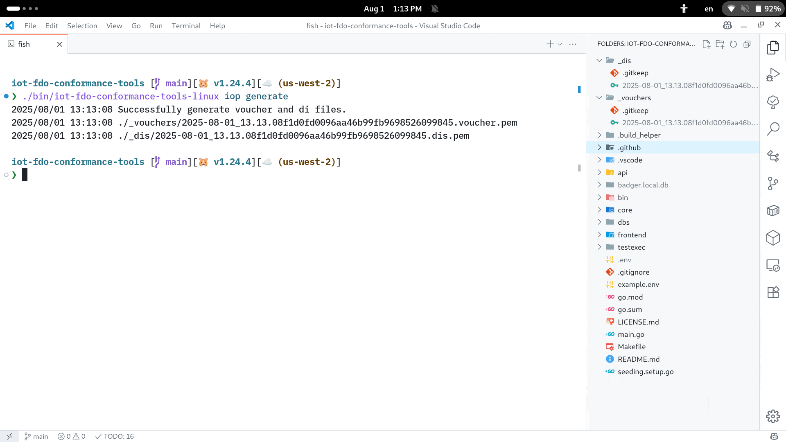

## FIDO Device Onboarding Conformance Server

## General info

FDO conformance tools are build in Golang for the backend, and Svelte NodeJS frontend framework for the frontend. Uses on disk key-value DB, so you do not need SQL or Mongo to run it.

## Interop

You can find interop documentation here: https://github.com/fido-alliance/conformance-test-tools-resources/tree/master/docs/FDO/Pre-Interop

## Pre requisites:

- Node JS 18+ https://nodejs.org/en/
- Golang 1.24+ https://go.dev/dl/
- Github access with configured SSH key https://docs.github.com/en/authentication/connecting-to-github-with-ssh
- (Windows) `make` - https://community.chocolatey.org/packages/make

## Configuration:

`make setup` - it will configure submodule, frontend nodejs deps, and goland packages:

- `preconfig_dotenv_file` - will create dotenv file with default values
- `make preconfig_frontend` - will only configure frontend nodejs deps
- `make preconfig_conformance_server` - will only configure golang dependencies

### Environment variables

- `PORT` - server port. Default 8080

- `DEV` - ENV_PROD(prod) for fully built version, ENV_DEV(dev) for development with frontend running in a dev mode

- `FDO_SERVICE_URL` - Domain to access FDO endpoints. Will be returned in RVInfo etc.

- `INTEROP_DASHBOARD_URL` - Dashboard URL for submitting results. Example http://http.dashboard.fdo.tools

- `INTEROP_DASHBOARD_RV_AUTHZ` - Access Token for Dashboard for RV operations: Example Bearer RV-xVqOOhmsSz/eTQBHPokXH16a48o9aU9kG3vkFG/vaaA=

- `INTEROP_DASHBOARD_DO_AUTHZ` - Access Token for Dashboard for DO Operations: Example Bearer RV-xVqOOhmsSz/eTQBHPokXH16a48o9aU9kG3vkFG/vaaA=

- `INTEROP_DO_TOKEN_MAPPING` - DO SIM mapping for FIDO Dashboard extensions. Example: [["6bb682fea2ee4164a10e5cd16a86efa8", "Bearer DEVICE-kGPJdtwYrojARYkrSoxynJEGqB0U9xwd9DgJ+UT+Ues="]]

## Building

- `make build` - will compile builds for Windows, Linux, and MacOS

- `make compile_all` - will only generate binaries for Windows, Linux, and MacOS

  - `make compile_win` - will only generate Windows binary
  - `make compile_linux` - will only generate Linux binary
  - `make compile_osx` - will only generate MacOS binary

- `make build_frontend` - will only regenerate static frontend

## Running

- `./bin/iot-fdo-conformance-tools-{OS} seed` will generate testing config, and pre-seed testing device credentials. This will take just a minute to run. Need to be run only once.
- `./bin/iot-fdo-conformance-tools-{OS} serve` will serve testing frontend on port 8080 (http://localhost:8080/).

## Usage

### Device tests

Before running the device tests, the ownership voucher and device credentials must be generated by the implementation that is being under test.

After generation, the ownership voucher should be added to the conformance tools server via the frontend (the Device tests section). Note, that ownership voucher must be provided in the [following format](https://github.com/fido-alliance/conformance-test-tools-resources/blob/main/docs/FDO/Pre-Interop/README.md#voucher-encoding-format). After adding the device, the test run should be started in the frontend. Then you can run your device, you'll need to do it multiple times to complete the test suite.

#### Examples

The following examples demonstrate how to perform device tests with the conformance tools device implementation.

- `./bin/iot-fdo-conformance-tools-{OS} iop generate` - Will generate test credentials for virtual device credentail `./_dis` and voucher `./_vouchers` files.

```bash
❯ ./bin/iot-fdo-conformance-tools-linux iop generate
2025/07/17 10:41:08 Successfully generate voucher and di files.
2025/07/17 10:41:08 ./_vouchers/2025-07-17_10.41.08f1d0fd00fe3f4b7db7ec8521092a4e69.voucher.pem
2025/07/17 10:41:08 ./_dis/2025-07-17_10.41.08f1d0fd00fe3f4b7db7ec8521092a4e69.dis.pem
```

- `./bin/iot-fdo-conformance-tools-{OS} iop to1 http://localhost:8080/ _dis/2025-07-17_10.41.08f1d0fd00fe3f4b7db7ec8521092a4e69.dis.pem` - Will start TO1 protocol testing to the server with the specified virtual device credential.

```bash
❯ ./bin/iot-fdo-conformance-tools-linux iop to1 http://localhost:8080/ _dis/2025-07-17_10.41.08f1d0fd00fe3f4b7db7
ec8521092a4e69.dis.pem
2025/07/17 10:43:29 Error running HelloRV30. HelloRV30: Failed to unmarshal HelloRvAck31. error decoding FdoError cbor: 3 bytes of extraneous data starting at index 18
❯ ./bin/iot-fdo-conformance-tools-linux iop to1 http://localhost:8080/ _dis/2025-07-17_10.41.08f1d0fd00fe3f4b7db7
ec8521092a4e69.dis.pem
2025/07/17 10:43:30 Error running ProveToRV32. RVRedirect33: Failed to unmarshal RVRedirect33. error decoding FdoError cbor: 110 bytes of extraneous data starting at index 19
❯ ./bin/iot-fdo-conformance-tools-linux iop to1 http://localhost:8080/ _dis/2025-07-17_10.41.08f1d0fd00fe3f4b7db7
ec8521092a4e69.dis.pem
2025/07/17 10:43:31 Success  DNS: localhost Port: 8080
```

- `./iot-fdo-conformance-tools-{OS} iop to2 http://localhost:8080/ _dis/2025-07-17_10.41.08f1d0fd00fe3f4b7db7ec8521092a4e69.dis.pem` - Will start TO2 protocol testing to the server with the specified virtual device credential.

```bash
❯ ./bin/iot-fdo-conformance-tools-linux iop to2 http://localhost:8080/ _dis/2025-07-17_10.41.08f1d0fd00fe3f4b7db7
ec8521092a4e69.dis.pem
2025/07/17 10:44:15 Starting HelloDevice60
2025/07/17 10:44:15 Error running HelloDevice60. HelloDevice60: Unknown Header HMac. failed to verify HMAC. HMACs do not match
❯ ./bin/iot-fdo-conformance-tools-linux iop to2 http://localhost:8080/ _dis/2025-07-17_10.41.08f1d0fd00fe3f4b7db7
ec8521092a4e69.dis.pem
2025/07/17 10:44:16 Starting HelloDevice60
2025/07/17 10:44:16 Error running HelloDevice60. HelloDevice60: DO returned wrong NonceTO2ProveOV

...

❯ ./bin/iot-fdo-conformance-tools-linux iop to2 http://localhost:8080/ _dis/2025-07-17_10.41.08f1d0fd00fe3f4b7db7
ec8521092a4e69.dis.pem
2025/07/17 10:44:32 Starting HelloDevice60
2025/07/17 10:44:32 Requesting GetOVNextEntry62 for entry 0
2025/07/17 10:44:32 Requesting GetOVNextEntry62 for entry 1
2025/07/17 10:44:32 Requesting GetOVNextEntry62 for entry 2
2025/07/17 10:44:32 Starting ProveDevice64
2025/07/17 10:44:32 Starting DeviceServiceInfoReady66
2025/07/17 10:44:32 Starting DeviceServiceInfo68
2025/07/17 10:44:32 Sending DeviceServiceInfo68 for sim devmod:active
2025/07/17 10:44:32 f5
2025/07/17 10:44:32 Sending DeviceServiceInfo68 for sim devmod:os
2025/07/17 10:44:32 656c696e7578
2025/07/17 10:44:32 Sending DeviceServiceInfo68 for sim devmod:arch
2025/07/17 10:44:32 65616d643634
2025/07/17 10:44:32 Sending DeviceServiceInfo68 for sim devmod:version
2025/07/17 10:44:32 68676f312e32342e34
2025/07/17 10:44:32 Sending DeviceServiceInfo68 for sim devmod:device
2025/07/17 10:44:32 78224649444f20446576696365204f6e626f617264205669727475616c20446576696365
2025/07/17 10:44:32 Sending DeviceServiceInfo68 for sim devmod:sep
2025/07/17 10:44:32 613b
2025/07/17 10:44:32 Sending DeviceServiceInfo68 for sim devmod:bin
2025/07/17 10:44:32 65616d643634
2025/07/17 10:44:32 Sending DeviceServiceInfo68 for sim devmod:nummodules
2025/07/17 10:44:32 01
2025/07/17 10:44:32 Sending DeviceServiceInfo68 for sim devmod:modules
2025/07/17 10:44:32 8301016d6669646f5f616c6c69616e6365
2025/07/17 10:44:32 Starting Done70
2025/07/17 10:44:32 Success To2
2025/07/17 10:44:32 Interop is not enabled, skipping IOP logger event submission
```

#### Demonstration GIF



### Rendezvous Server tests

The RV server's URL can be added in the frontend (Rendezvous Server tests section). Then the TO1 and TO2 test runs can be executed against it from the same frontend section.

#### Demonstration GIF


### Device Onboarding service tests

The DO server's URL should be added in the frontend (Device Onboarding service section), note that the owner's private key must be provided too. This will create a separate test run for a specified server. After that the generated test voucher should be downloaded from the frontend and uploaded into the DO's vouchers storage. Then the TO2 test run can be executed.

#### Examples

The following examples show how to perform the tests using the conformance tools DO implementation. Note, that for the conformance tools implementation any private key can be provided during the test case initialization.

The downloaded voucher should be uploaded into the db:

```bash
❯ ./bin/iot-fdo-conformance-tools-linux iop do_load_vouchers localhost_8080.vouchers/
2025/07/28 11:55:01 Saved voucher for f1d0fd00-95c9-4a61-89ee-447a0959a757
```

Then, the test run can be executed against the DO:

```bash
❯ ./bin/iot-fdo-conformance-tools-linux serve
2025/07/28 11:55:10 Database already seeded. Skipping...
2025/07/28 11:55:10 Starting server at port 8080...
. http://localhost:8080
2025/07/28 11:55:27 ----- Starting New Run For 19be306e0c14436faefc61709e36a1d7 -----
2025/07/28 11:55:27 HelloDevice60: Receiving...
2025/07/28 11:55:27 Err: 60 Failed to decode HelloDevice60! 100
2025/07/28 11:55:27 HelloDevice60: Receiving...
...
2025/07/28 11:55:28 Done70: Receiving...
2025/07/28 11:55:28 Interop is not enabled, skipping IOP logger event submission
2025/07/28 11:55:28 ----- Finishing Run For 19be306e0c14436faefc61709e36a1d7 -----
```

#### Demonstration GIF


## Development

All the steps above should be done, nothing else is needed.

### Structure

The backend consists of the following modules:

- [Core](https://github.com/fido-alliance/iot-fdo-conformance-tools/tree/main/core) - contains all core protocol implementations, such as RV, DO, Device, and Shared.

  - [FDO: Shared](https://github.com/fido-alliance/iot-fdo-conformance-tools/tree/main/core/shared) - a common module for all FDO operations that has all the crypto, structs definitions, and registry for commands, codes, and algorithms.
  - [FDO: DO Service](https://github.com/fido-alliance/iot-fdo-conformance-tools/tree/main/core/do) - Device Onboarding Service with full implementation of FDO DO TO0 and TO2 protocols. It also contains all related tests.
  - [FDO: RV Service](https://github.com/fido-alliance/iot-fdo-conformance-tools/tree/main/core/rv) - Rendezvous Service with full implementation of FDO DO TO0 and TO1 protocols. It also contains all related tests.
  - [FDO: Device Implementation Service](https://github.com/fido-alliance/iot-fdo-conformance-tools/tree/main/core/device) - Virtual Device Implementation with full implementation of FDO DO TO1 and TO2 protocols. It also contains all related tests.

- [Conformance Server - API](https://github.com/fido-alliance/iot-fdo-conformance-tools/tree/main/api) - A user facing conformance server. Has testing structs, conformance APIs, conformance tests ID and much much more.
- [Conformance Server - Frontend](https://github.com/fido-alliance/iot-fdo-conformance-tools/tree/main/frontend) - A frontend for FIDO Conformance Server

- [`testexec`](https://github.com/fido-alliance/iot-fdo-conformance-tools/tree/main/testexec) - Contains TO0 DO, TO1 Device, TO2 Device conformance testing execution.
- [`core/shared/testcom`](https://github.com/fido-alliance/iot-fdo-conformance-tools/tree/main/core/shared/testcom) - Contains common test methods, dbs, etc
  - [`core/shared/testcom/listener`](https://github.com/fido-alliance/iot-fdo-conformance-tools/tree/main/core/shared/testcom/listener) - Contains all listener tests dependencies for `RV(TO0)`, `RV(TO1)`, and `DO(TO2)`
  - [`core/shared/testcom/request`](https://github.com/fido-alliance/iot-fdo-conformance-tools/tree/main/core/shared/testcom/request) - Contains all requestor tests dependencies for `DO(TO0)`, `Device(TO1)`, `Device(TO2)`

## [License](LICENSE.md)

This code is licensed under the Apache License 2.0. Please see the [License](LICENSE.md) for more information.
